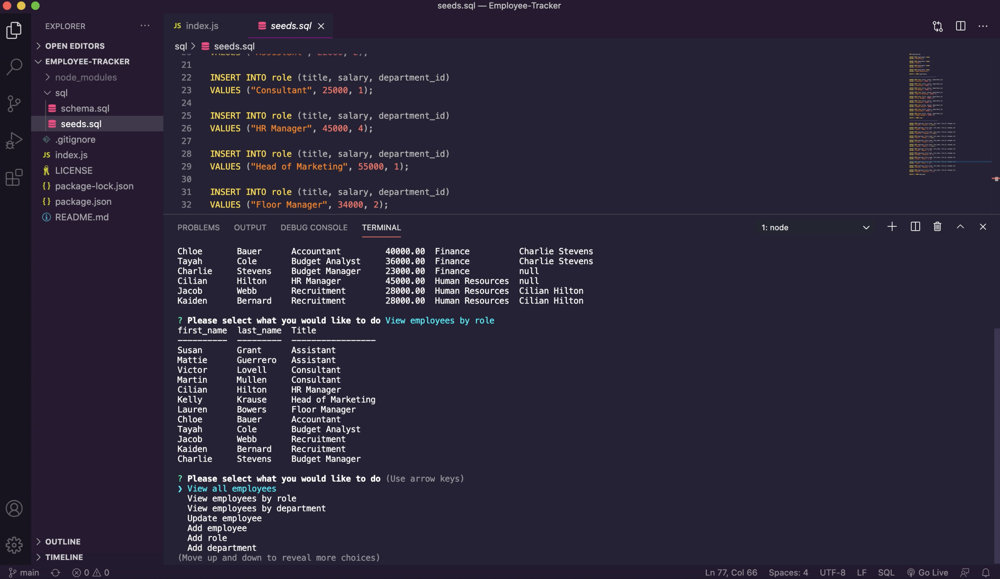

# Employee Tracker
A command line application that tracks employees and their roles

## Pseudo Code
1. Install node packages - mysql, inquirer, console.table
2. Create prompts
3. Create functions to view employees, view by department, view by role
4. Create functions to add employees, add roles, add departments
5. Create function to update employee information

Based on this my code would have to:
- Run as a command line application
- Utilise mysql to create a table that stores this information 

## Difficulties
I had to research a lot about joins as they were quite confusing, but I managed to figure it out in the end so I think it seems a bit simpler now. I also struggled at the start with running mysql but this was an error with my computer and once it was fixed I enjoyed using mysql.

## Overall thoughts
I like the simplicity and straightforward syntax of mysql and am looking forward to learning more about it and using it in future projects.

## Video Demo
You can view a walkthrough of the application [here](https://drive.google.com/file/d/1y_OT4iw0qSs7MxmRZIHyO1yyvIakdsj_/view?usp=sharing)

